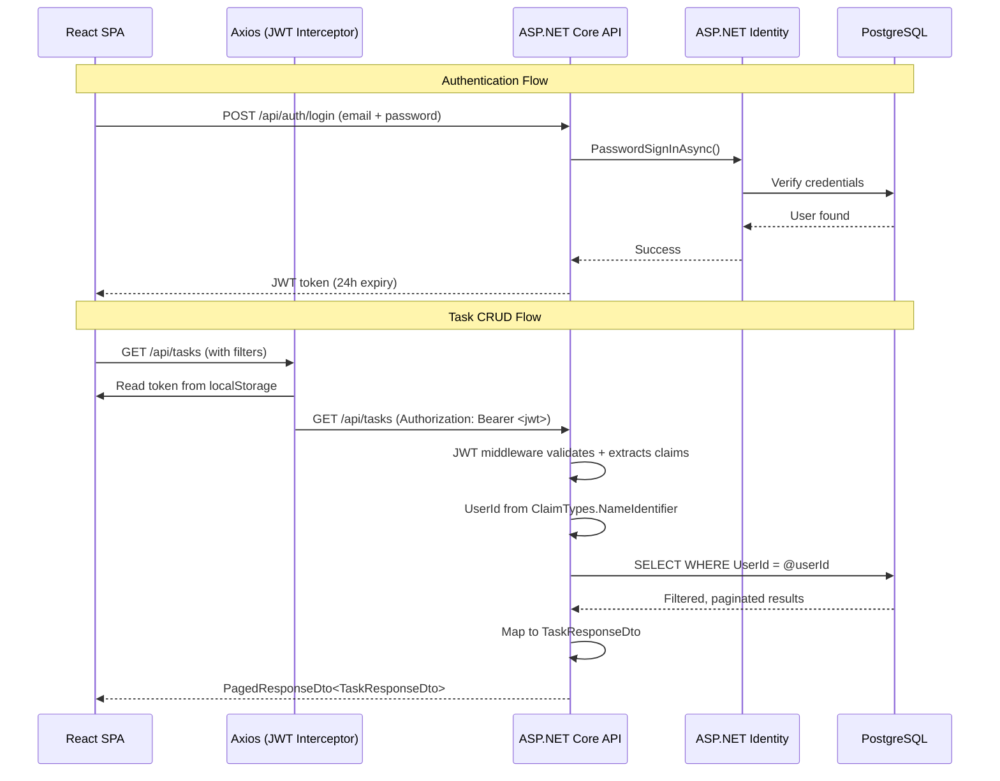
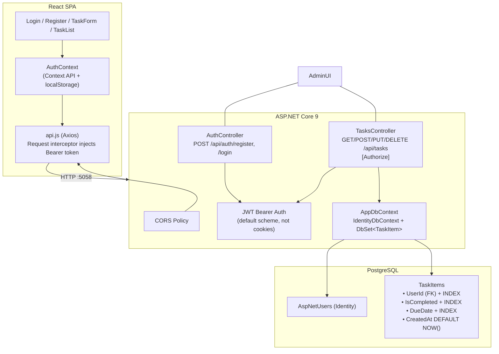

# ToDoFullStack


A full-stack task manager focused on clean API design, user-scoped data isolation, and server-side pagination. React 19 SPA talks to an ASP.NET Core 9 API backed by PostgreSQL.

---

## Request Lifecycle





---

## Authentication & JWT

**JWT Bearer is the default scheme**, not a fallback — Identity's cookie middleware is explicitly overridden to return 401/403 instead of redirecting. This is necessary because a React SPA cannot use cookie auth cross-origin without complex CSRF handling, and Bearer tokens are the idiomatic choice for SPAs.

```csharp
// Program.cs — default scheme set to JWT, not Identity cookies
builder.Services.AddAuthentication(options =>
{
    options.DefaultAuthenticateScheme = JwtBearerDefaults.AuthenticationScheme;
    options.DefaultChallengeScheme = JwtBearerDefaults.AuthenticationScheme;
    options.DefaultScheme = JwtBearerDefaults.AuthenticationScheme;
})
```

The JWT is issued with three claims: `sub` (standard subject), `ClaimTypes.NameIdentifier` (what `UserManager.GetUserId()` reads), and `ClaimTypes.Email`. The `nameIdentifier` claim is critical — without it, the controllers' `_userManager.GetUserId(User)` returns null and every task query silently returns zero results.

Token validation checks issuer (`"ToDoApi"`), audience (`"ToDoClient"`), lifetime, and signing key. This prevents a token stolen from one service from being replayed against another.

---

## DTO Pattern & Over-Posting Prevention

The entity model (`TaskItem`) is never exposed directly in requests or responses. Every endpoint uses a dedicated DTO to control exactly which fields cross the API boundary:

| DTO | Purpose | Key constraint |
|---|---|---|
| `CreateTaskDto` | Accepts input for new tasks | **No** `UserId`, `CreatedAt`, or `IsCompleted` fields — client cannot inject them |
| `UpdateTaskDto` | Partial updates (all nullable) | Only non-null fields are applied — send `{ "isCompleted": true }` without re-sending title, description, etc. |
| `TaskResponseDto` | Returns task data to client | Omits `UserId` (internal FK) and navigation properties |

This prevents **over-posting attacks**: a malicious client cannot craft a request to set `IsCompleted=true` on creation or inject a foreign `UserId` — those fields simply do not exist in the request DTOs. It also decouples internal schema changes from the public API contract.

The `UpdateTaskDto` uses a custom setter to enforce `DateTimeKind.Utc` on incoming dates:

```csharp
public DateTime? DueDate
{
    set => _dueDate = value.HasValue
        ? DateTime.SpecifyKind(value.Value, DateTimeKind.Utc)
        : value;
}
```

This prevents the silent `Unspecified` → `Local` conversion that EF Core applies when writing to PostgreSQL.

---

## User Isolation at Row Level

Every task query is scoped to the authenticated user via `UserId` extracted from the JWT:

```csharp
// TasksController.cs — every action
var userId = _userManager.GetUserId(User)!;
var query = _db.Tasks.Where(t => t.UserId == userId);
```

This is enforced in **all five** controller actions (list, get, create, update, delete), not just the list endpoint. Even if a client crafts a request for another user's task ID, the WHERE clause blocks it. The `UserId` column is indexed in the database so this filter does not require a sequential scan.

```csharp
// AppDbContext.OnModelCreating
b.Entity<TaskItem>().HasIndex(t => t.UserId);
b.Entity<TaskItem>().HasIndex(t => t.IsCompleted);
b.Entity<TaskItem>().HasIndex(t => t.DueDate);
```

Additional indexes on `IsCompleted` and `DueDate` support the two most common query patterns: filtering by completion status and sorting by due date. The `CreatedAt` column uses `HasDefaultValueSql("NOW()")` so the database owns the timestamp, eliminating clock-skew issues across app instances.

---

## Server-Side Pagination

```csharp
GET /api/tasks?page=2&pageSize=10&completed=false&search=groceries
```

The `PagedResponseDto<T>` generic wrapper returns paginated results with all metadata the UI needs to render page controls:

```csharp
public class PagedResponseDto<T> {
    public List<T> Items { get; set; }      // The current page
    public int TotalCount { get; set; }      // Total matching rows
    public int Page { get; set; }            // Current page number
    public int PageSize { get; set; }        // Items per page
    public int TotalPages =>                // Computed property
        (int)Math.Ceiling(TotalCount / (double)PageSize);
}
```

Search is also server-side (`WHERE Title LIKE '%search%' OR Description LIKE '%search%'`). Loading all tasks into memory and filtering/paginating on the client does not scale — with 10,000 tasks this API returns 10 rows instead of 10,000.

---

## Getting Started

```bash
# 1. Start PostgreSQL
docker run --name todo-postgres \
  -e POSTGRES_PASSWORD=Pass123! -e POSTGRES_DB=todo \
  -p 5432:5432 -d postgres:16

# 2. Start the API (auto-migrates DB on startup)
dotnet run
# → http://localhost:5058 | Swagger: http://localhost:5058/swagger

# 3. Start the frontend
cd todo-frontend && npm install && npm start
# → http://localhost:3000
```

## API

| Method | Endpoint | Auth | Description |
|---|---|---|---|
| POST | `/api/auth/register` | No | Register user |
| POST | `/api/auth/login` | No | Login, returns JWT |
| GET | `/api/tasks?page=&pageSize=&completed=&search=` | Yes | List (paginated, filterable) |
| POST | `/api/tasks` | Yes | Create |
| PUT | `/api/tasks/{id}` | Yes | Partial update |
| DELETE | `/api/tasks/{id}` | Yes | Delete |
