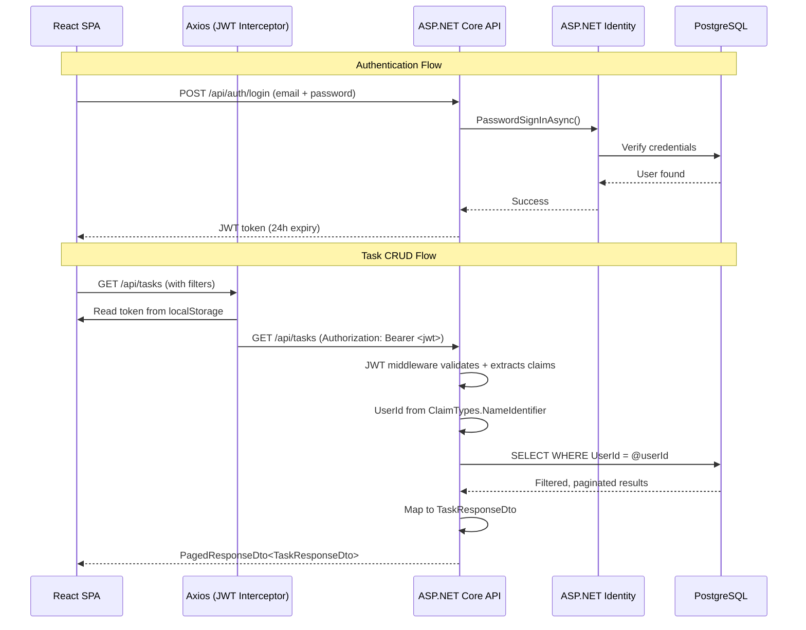

# ToDoFullStack


A full-stack task management application built to demonstrate a clean, production-oriented architecture. The project prioritizes separation of concerns, API security, and real-world patterns over framework defaults.

---

## Architecture



### Request Lifecycle

```
┌─────────────────────────────────────────────────────────────────┐
│                         React SPA                              │
│  ┌──────────┐  ┌──────────┐  ┌──────────┐  ┌───────────────┐  │
│  │  Login   │  │ Register │  │ TaskForm │  │   TaskList    │  │
│  └────┬─────┘  └────┬─────┘  └────┬─────┘  └───────┬───────┘  │
│       │             │             │                 │          │
│       └─────────────┴─────────────┴─────────────────┘          │
│                              │                                  │
│                      ┌───────▼───────┐                          │
│                      │  AuthContext   │                         │
│                      │  (Context API) │                         │
│                      └───────┬───────┘                          │
│                              │ token                            │
│                      ┌───────▼───────┐                          │
│                      │   api.js     │                           │
│                      │  (Axios)     │                           │
│                      │  Interceptor  │── injects Bearer token   │
│                      └───────┬───────┘                          │
└──────────────────────────────┼──────────────────────────────────┘
                               │ HTTP
┌──────────────────────────────▼──────────────────────────────────┐
│                     ASP.NET Core 9 API                          │
│  ┌──────────────────┐    ┌──────────────────────────────┐       │
│  │   CORS Policy    │    │  JWT Bearer Auth             │       │
│  └──────────────────┘    │  (default scheme, not cookie)│       │
│                          └──────────────┬───────────────┘       │
│  ┌──────────────────┐    ┌──────────────▼───────────────┐       │
│  │  AuthController  │    │      TasksController          │       │
│  │  /api/auth       │    │      /api/tasks              │       │
│  └────────┬─────────┘    │      [Authorize]             │       │
│           │              └──────────────┬───────────────┘       │
│           │                             │                       │
│  ┌────────▼─────────────────────────────▼───────────────┐       │
│  │              AppDbContext                            │       │
│  │   IdentityDbContext<IdentityUser>                    │       │
│  │   + DbSet<TaskItem> Tasks                           │       │
│  └─────────────────────┬────────────────────────────────┘       │
│                        │ EF Core                                │
└────────────────────────┼────────────────────────────────────────┘
                         │
┌────────────────────────▼────────────────────────────────────────┐
│                     PostgreSQL                                  │
│  ┌────────────────────────────────────┐                         │
│  │  AspNetUsers (Identity)            │                         │
│  │  AspNetRoles                       │                         │
│  │  TaskItems                         │                         │
│  │    • UserId (FK) + INDEX           │                         │
│  │    • IsCompleted + INDEX           │                         │
│  │    • DueDate + INDEX               │                         │
│  │    • CreatedAt DEFAULT NOW()       │                         │
│  └────────────────────────────────────┘                         │
└─────────────────────────────────────────────────────────────────┘
```

---

## Tech Stack

| Layer | Technology |
|---|---|
| Backend | ASP.NET Core 9, Entity Framework Core 9 |
| Auth | ASP.NET Core Identity + JWT Bearer (SymmetricKey, HMACSHA256) |
| Database | PostgreSQL 16 (local Docker / Azure PostgreSQL) |
| Frontend | React 19, Axios, React Router v7, Context API |
| API Docs | Swagger / Swashbuckle |
| CI/CD | GitHub Actions → Azure Web Apps (OIDC) |

---

## Project Structure

```
ToDoFullStack/
├── Controllers/              # API endpoints
│   ├── AuthController.cs     # POST /api/auth/register, /login
│   └── TasksController.cs    # CRUD at /api/tasks
├── Models/                   # Domain + data layer
│   ├── AppDbContext.cs       # EF Core context (Identity + Tasks)
│   └── TaskItem.cs           # Task entity
├── DTOs/                     # Data Transfer Objects (never expose entities)
│   ├── CreateTaskDto.cs
│   ├── UpdateTaskDto.cs
│   ├── TaskResponseDto.cs
│   ├── PagedResponseDto.cs
│   ├── LoginDto.cs
│   ├── LoginResponseDto.cs
│   └── RegisterDto.cs
├── Migrations/               # EF Core auto-generated
├── Program.cs                # Composition root
├── appsettings.json          # Configuration
└── todo-frontend/            # React SPA
    ├── src/
    │   ├── components/       # UI components
    │   │   ├── Login.js
    │   │   ├── Register.js
    │   │   ├── TaskForm.js
    │   │   ├── TaskList.js
    │   │   └── TaskItem.js
    │   ├── context/
    │   │   └── AuthContext.js # JWT state management
    │   ├── services/
    │   │   └── api.js        # Axios instance + interceptors
    │   └── styles/
    │       └── App.css
    └── package.json
```

---

## Backend Architecture

### Authentication & JWT

The app uses **JWT Bearer tokens** as the default authentication scheme explicitly — not Identity's cookie-based flow. This matters because a React SPA cannot use cookie auth without complex CSRF handling; Bearer tokens are the idiomatic choice for SPAs.

```
Register → IdentityUser created in AspNetUsers → Login → PasswordSignInAsync
→ JWT issued with claims (sub, nameIdentifier, email) → 24h expiry
→ Client sends as "Authorization: Bearer <token>"
→ JWT middleware validates signature, issuer, audience, lifetime
→ Controller reads UserId via ClaimTypes.NameIdentifier
```

Key decisions:
- **JWT is the default scheme**, not a fallback. Identity's cookie redirect is overridden to return 401/403 instead of redirecting.
- **Claims include `nameIdentifier`** (not just `sub`) because `UserManager.GetUserId()` reads from `ClaimTypes.NameIdentifier`.
- **Issuer + Audience validation** prevents token reuse across different services.

### Data Model & Database Design

```csharp
public class TaskItem {
    Guid Id          // PK, generated client-side via Guid.NewGuid()
    string Title
    string? Description
    DateTime? DueDate
    bool IsCompleted
    int Priority     // 1-5 scale
    string UserId    // FK to AspNetUsers.Id
    IdentityUser User
    DateTime CreatedAt  // DB default: NOW()
}
```

Database indexes on **UserId**, **IsCompleted**, and **DueDate** — the three columns used in every production query (filtering by user + completion status + sort by due date). `CreatedAt` uses `HasDefaultValueSql("NOW()")` to let the database own the timestamp, avoiding inconsistencies from app-level clocks.

### DTO Pattern (Security + API Stability)

The entity model is never exposed directly in API responses or accepted directly in requests. Every endpoint uses dedicated DTOs:

- **CreateTaskDto** — only accepts title, description, dueDate, priority. Ignores any injected fields like `UserId` or `CreatedAt`.
- **UpdateTaskDto** — patch-style (all nullable properties). A partial update sends only the changed fields, which the controller applies conditionally.
- **TaskResponseDto** — returns only the fields the client needs. No navigation properties, no internal IDs.

This prevents **over-posting** attacks (a malicious client can't set `IsCompleted=true` on creation if you forgot to exclude it) and decouples internal model changes from the public API contract.

### User Isolation (Multi-Tenant at Row Level)

Every task query filters by `UserId` extracted from the JWT:

```csharp
var userId = _userManager.GetUserId(User); // from JWT claim
var query = _db.Tasks.Where(t => t.UserId == userId);
```

This happens in **every** controller action — not just the list endpoint. A user can only see, update, or delete their own tasks. The database index on `UserId` makes this efficient at scale.

### Pagination & Filtering (Server-Side)

```
GET /api/tasks?page=2&pageSize=10&completed=false&search=groceries
```

The `PagedResponseDto<T>` generic wrapper provides:
```csharp
public class PagedResponseDto<T> {
    List<T> Items          // The page of results
    int TotalCount         // Total matching rows (for UI)
    int Page               // Current page
    int PageSize           // Items per page
    int TotalPages         // Computed: Ceil(TotalCount / PageSize)
}
```

Search is server-side (`WHERE Title LIKE '%search%' OR Description LIKE '%search%'`), not client-side filtering of an already-loaded list. This matters when the dataset grows beyond a few hundred items.

---

## Frontend Architecture

### Auth Context & Token Persistence

```mermaid
flowchart LR
    A[Login Component] -->|login(token)| B[AuthContext]
    B -->|setState + localStorage| C[Token stored]
    C -->|useEffect syncs| D[isAuthenticated = true]
    D --> E[React re-renders: show App, hide Login]
    F[Page Refresh] -->|useEffect reads localStorage| B
```

The `AuthContext` uses React Context API with `localStorage` persistence. On mount, it reads any existing token from localStorage. On login, it stores the token and sets `isAuthenticated: true`, which causes the `AppContent` component to conditionally render the task management UI instead of the auth forms.

No refresh token logic — this is a deliberate simplification for this project scope. The JWT lives for 24 hours, and expired tokens are handled as 401 responses.

### API Service Layer

The Axios instance uses a **request interceptor** to inject the JWT from localStorage into every outgoing request:

```javascript
api.interceptors.request.use((config) => {
  const token = localStorage.getItem('token');
  if (token) config.headers.Authorization = `Bearer ${token}`;
  return config;
});
```

All API calls are centralized in `api.js` under `authAPI` and `tasksAPI` objects — no raw `fetch()` calls scattered across components.

### Component Tree

```
<App>
  <AuthProvider>                 // Context provider wrapping everything
    <AppContent>
      │  if !isAuthenticated:
      ├── <Login onSwitchToRegister />
      └── <Register onSwitchToLogin />
      │  if isAuthenticated:
      ├── <header> + logout button
      ├── <TaskForm onTaskCreated />     // Sidebar: create new task
      └── <TaskList key={refreshTasks}>  // Main content
            ├── Search + filter controls
            ├── <TaskItem /> × N
            └── Pagination controls
```

The `refreshTasks` counter (`key` prop on `TaskList`) is an elegant trick: when a new task is created, incrementing the counter forces React to unmount and remount `TaskList`, triggering a fresh data fetch.

---

## Key Architectural Decisions (The Thought Process)

| Decision | Rationale |
|---|---|
| **JWT over cookies** | SPAs can't set HttpOnly cookies cross-origin without complex CSRF. Bearer tokens are simpler and idiomatic for API-to-SPA communication. Trade-off: token storage in localStorage is XSS-vulnerable (mitigated by sanitizing all inputs). |
| **DTOs not raw entities** | Prevents over-posting (e.g., a user setting `IsAdmin=true` on registration). Decouples API contract from internal schema. A `TaskResponseDto` can omit fields (like `UserId`) without affecting the client. |
| **Server-side pagination** | Loading all tasks into memory and paginating in JavaScript does not scale. With 10,000 tasks, the API returns 10 instead of 10,000. The `PagedResponseDto<T>` pattern is reusable for any list endpoint. |
| **ASP.NET Identity** | Battle-tested, handles password hashing (PBKDF2), account lockout, and role management out of the box. Rolling custom auth is a common mistake — Identity gives all the primitives for free. |
| **User-scoped queries on the server** | Filtering by `UserId` in every controller action ensures data isolation at the database level — not just hiding UI elements. Even a malicious API client can't read another user's tasks. |
| **Patch-style updates** | All fields in `UpdateTaskDto` are nullable, and only non-null fields are applied. This lets the client send a partial update (e.g., just `{ "isCompleted": true }`) without requiring the full object. Saves bandwidth and simplifies client logic. |
| **Database-level `CreatedAt` default** | `HasDefaultValueSql("NOW()")` ensures the timestamp is set consistently even if the app layer sends an incorrect value. Multiple app instances or clock skew won't cause inconsistent creation times. |
| **Auto-migration on startup** | `db.Database.Migrate()` applies pending migrations when the app starts. Useful for local dev and demo deployments — no separate `dotnet ef database update` step needed. Would be disabled in production with a controlled deployment pipeline. |

---

## Getting Started

### Prerequisites

- [.NET 9 SDK](https://dotnet.microsoft.com/en-us/download)
- [Node.js](https://nodejs.org/) (v18+)
- [Docker](https://www.docker.com/) (for local PostgreSQL)
- [PostgreSQL client tools](https://www.postgresql.org/download/) (optional)

### Local Development

```bash
# 1. Start PostgreSQL
docker run --name todo-postgres \
  -e POSTGRES_PASSWORD=Pass123! \
  -e POSTGRES_DB=todo \
  -p 5432:5432 \
  -d postgres:16

# 2. Start the API
dotnet run
# API runs on http://localhost:5058
# Swagger at http://localhost:5058/swagger

# 3. Start the frontend (in a separate terminal)
cd todo-frontend
npm install
npm start
# App runs on http://localhost:3000
```

The database is auto-created and migrated on first API startup via `db.Database.Migrate()` in `Program.cs`.

### Configuration

The local connection string is hardcoded in `Program.cs` for convenience:

```
Host=localhost;Database=todo;Username=postgres;Password=Pass123!;Port=5432
```

The production connection string lives in `appsettings.json` for Azure deployment.

---

## API Reference

| Method | Endpoint | Auth | Description |
|---|---|---|---|
| POST | `/api/auth/register` | No | Create a new user account |
| POST | `/api/auth/login` | No | Authenticate, returns JWT token |
| GET | `/api/tasks` | Yes | List tasks (paginated, filterable) |
| GET | `/api/tasks/{id}` | Yes | Get a single task by ID |
| POST | `/api/tasks` | Yes | Create a new task |
| PUT | `/api/tasks/{id}` | Yes | Update a task (partial) |
| DELETE | `/api/tasks/{id}` | Yes | Delete a task |

### Query Parameters for `GET /api/tasks`

| Parameter | Type | Default | Description |
|---|---|---|---|
| `page` | int | 1 | Page number |
| `pageSize` | int | 10 | Items per page |
| `completed` | bool | — | Filter by completion status |
| `search` | string | — | Search in title/description |

---

## CI/CD

The project deploys to **Azure Web Apps** (todoapi-norm) via GitHub Actions:

1. **Build** — `dotnet build --configuration Release`, then `dotnet publish`
2. **Deploy** — Uses `azure/login@v2` with OIDC (no client secrets in GitHub), then `azure/webapps-deploy@v3`

The workflow triggers on push to the `main` branch.
